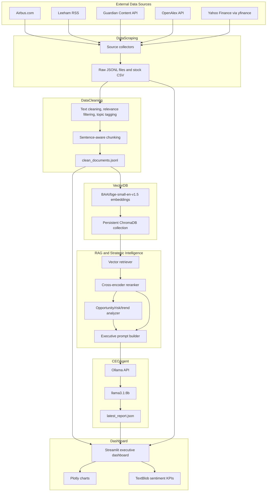
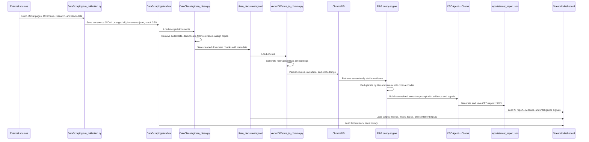
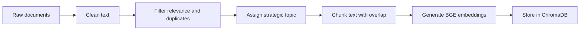

# Airbus Strategic Intelligence System

Implements **Task 1: Live Data Collection** with 5 sources — 4 need zero
setup, the 5th (Guardian) needs one free, instant API key.

| Category  | Source                          | Auth needed?              |
|-----------|----------------------------------|----------------------------|
| Company   | Airbus.com (ZEROe, Investors)     | none                       |
| News      | Leeham News and Analysis (RSS)    | none                       |
| News      | The Guardian (Content API)        | free key (instant)         |
| Research  | OpenAlex                         | none                       |
| Stock     | yfinance (ticker `AIR.PA`)        | none                       |

4 categories represented (company/news/research/stock), well past the
spec's "3+ independent sources" minimum.

## ⚠️ Run this locally
This needs real internet access (airbus.com, leehamnews.com,
theguardian.com, openalex.org, finance data endpoints). It won't run in
network-restricted sandboxes.

## Setup

```bash
python -m venv venv
source venv/bin/activate        # Windows: venv\Scripts\activate
pip install -r requirements.txt
cp .env.example .env
```

Then get your free Guardian key (takes under a minute, no approval wait):
https://open-platform.theguardian.com/access/ — paste it into `.env` as
`GUARDIAN_API_KEY=...`.

If you skip this step, the pipeline still runs — the Guardian collector
just logs a warning and contributes 0 documents instead of crashing.

## Run

```bash
python run_collection.py
```

Output:
- `data/raw/<source>.jsonl` — one file per collector
- `data/raw/all_documents.jsonl` — merged + deduplicated
- `data/raw/airbus_price_history.csv` — raw OHLC price data for the dashboard

## Expect an uneven document count across sources — that's normal

- **OpenAlex** will dominate the count (likely 200-400+ docs across its 5
  query angles) — it has no practical pagination limit.
- **Guardian** typically contributes the second-largest chunk — up to 250
  docs (5 pages × 50/page) of full article text about Airbus specifically.
- **Leeham** RSS only exposes the ~10-20 *most recent* posts — RSS feeds
  aren't archives. Fine for hitting the 100-doc minimum, thin if you want
  deep historical news coverage from this source specifically.
- **Airbus.com** contributes 2 documents (one per page) — expected for a
  single official-source category, not a bug.
- **yfinance** gives 1 price-history summary + however many recent
  headlines Yahoo currently has attached to the ticker (typically 10-30).


## Known caveats

- **Airbus.com** is partly React/Next.js-rendered. The collector logs a
  warning if a page returns under 200 characters of text — fix would be
  swapping in Playwright for just that page if it happens.
- **Leeham** paywalled "Premium" posts only yield a teaser, not full text —
  expected, not a bug.
- **yfinance** is an unofficial wrapper around Yahoo's endpoints — reliable
  in practice but can break without notice.

## Document schema

Every collector returns documents shaped like this, so Task 2/3 (cleaning,
embeddings, indexing) can treat all sources uniformly:

```json
{
  "doc_id": "md5 hash of url+source — used for dedup",
  "source_name": "Leeham News and Analysis",
  "source_category": "news",
  "title": "...",
  "url": "...",
  "published_date": "...",
  "content": "...",
  "collected_at": "ISO timestamp of when we scraped it",
  "metadata": { "...source-specific extras..." }
}
```

## Next steps

Once `all_documents.jsonl` is populated, next is Task 2/3: embeddings
(e.g. `bge-small-en-v1.5`) + a vector store (FAISS or ChromaDB) for
retrieval.

This project builds an Airbus-focused strategic intelligence assistant. It collects live company, news, research, and market data; cleans and chunks the corpus; embeds it into a persistent vector database; retrieves and reranks evidence; analyzes opportunities, risks, and trends; and generates a CEO-style briefing that is displayed in a Streamlit dashboard.

## Deliverable 3: Architecture Documentation

### System Architecture Diagram



### Data Flow Diagram



### Technology Stack

| Layer | Technologies | Purpose |
|---|---|---|
| Language | Python | Main implementation language for scraping, processing, RAG, agent, and dashboard |
| Data collection | requests, BeautifulSoup, feedparser, yfinance, python-dotenv | Web/API collection from Airbus, Leeham, Guardian, OpenAlex, and Yahoo Finance |
| Data storage | JSONL, CSV | Simple file-based raw and processed data stores |
| Cleaning and preprocessing | Python regex, pathlib, collections | Boilerplate removal, deduplication, word-count filtering, topic labeling, chunking |
| Embeddings | sentence-transformers, BAAI/bge-small-en-v1.5 | Dense vector representation of cleaned chunks and queries |
| Vector database | ChromaDB persistent client | Local semantic search collection named `airbus_knowledge_base` |
| Reranking | cross-encoder/ms-marco-MiniLM-L-6-v2 | Improves retrieved evidence ranking before prompt construction |
| Strategic analysis | Custom keyword-weight scoring | Classifies retrieved evidence into opportunities, risks, and trends |
| LLM runtime | Ollama, llama3.1:8b | Local report generation from retrieved evidence |
| Dashboard | Streamlit, pandas, Plotly, TextBlob | Executive UI, charts, feeds, sentiment metrics, recommendations, and CEO briefing |

### Design Decisions

1. **File-first pipeline before database indexing**
   Raw and processed data are stored as JSONL files before embeddings are created. This makes each stage inspectable, reproducible, and easy to rerun independently.

2. **Common document schema across heterogeneous sources**
   All collectors output shared fields such as `doc_id`, `source_name`, `source_category`, `title`, `url`, `published_date`, `content`, `collected_at`, and `metadata`. Later cleaning, indexing, and dashboard logic can therefore stay source-agnostic.

3. **Source diversity over a single large source**
   The corpus combines official company content, specialist aerospace news, mainstream news, academic/research metadata, and stock data. This supports broader strategic analysis than a single-source monitor.

4. **Chunk-level retrieval with parent metadata**
   Documents are split into sentence-aware chunks of about 150 words with overlap. Each chunk keeps parent document metadata, allowing precise retrieval while preserving source attribution.

5. **Local persistent vector database**
   ChromaDB is stored under `VectorDB/chroma_store`, so the knowledge base survives between runs and the dashboard/agent can query it without rebuilding embeddings every time.

6. **Retrieve first, rerank second**
   The system retrieves a wider candidate set using vector similarity, then applies a cross-encoder reranker. This balances speed with better final evidence quality.

7. **Evidence-constrained generation**
   The prompt instructs the LLM to use only retrieved evidence and avoid inventing facts. This reduces hallucination risk and makes recommendations traceable to retrieved source titles.

8. **Local LLM through Ollama**
   `llama3.1:8b` runs locally through Ollama, keeping the strategic corpus local and avoiding dependency on a hosted LLM for the demo.

9. **Dashboard reads generated artifacts**
   The Streamlit app reads `clean_documents.jsonl`, `latest_report.json`, and the stock CSV rather than calling every upstream stage live. This keeps the UI responsive and separates data generation from presentation.

### AI Pipeline

The AI pipeline has two modes: an offline indexing pipeline and a runtime intelligence-generation pipeline.

#### Offline Indexing Pipeline



1. `DataScraping/run_collection.py` collects Airbus-related data and writes source-specific JSONL files plus `all_documents.jsonl`.
2. `DataCleaning/data_clean.py` removes boilerplate, drops low-quality or irrelevant documents, deduplicates titles, assigns strategic topics, and creates retrieval-ready chunks.
3. `VectorDB/store_to_chroma.py` embeds each cleaned chunk with `BAAI/bge-small-en-v1.5` and stores the chunk text, metadata, and vector in ChromaDB.

#### Runtime RAG and Agent Pipeline

```mermaid
flowchart LR
    Q["Strategic query"] --> R["Embed query"]
    R --> S["Retrieve top candidates from ChromaDB"]
    S --> T["Deduplicate by title"]
    T --> U["Cross-encoder rerank"]
    U --> V["Opportunity/risk/trend scoring"]
    V --> W["Build executive prompt"]
    W --> X["Generate report with llama3.1:8b"]
    X --> Y["Save reports/latest_report.json"]
    Y --> Z["Display in Streamlit dashboard"]
```



- `RAG/retriever.py` embeds the query and retrieves matching chunks from ChromaDB.
- `RAG/reranker.py` reranks candidate chunks using `cross-encoder/ms-marco-MiniLM-L-6-v2`.
- `StrategicIntelligenceEngine/strategic_analyzer.py` scores chunks for opportunities, risks, and trends using weighted strategic keywords.
- `RAG/prompt_builder.py` builds a structured CEO-report prompt with evidence snippets and detected intelligence signals.
- `CEOAgent/ceo_agent.py` runs the autonomous strategic query and calls the local LLM through `CEOAgent/llm_agent.py`.
- `generate_report.py` saves the generated report and supporting evidence to `reports/latest_report.json`.
- `Dashboard/app.py` displays the report, opportunities, risks, trends, recommendations, sentiment analysis, stock chart, source mix, and recent intelligence feeds.

---
