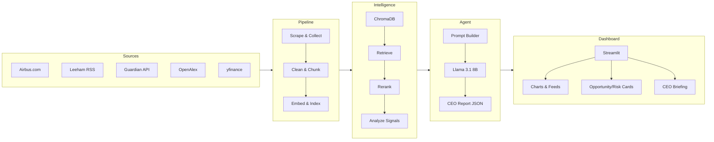
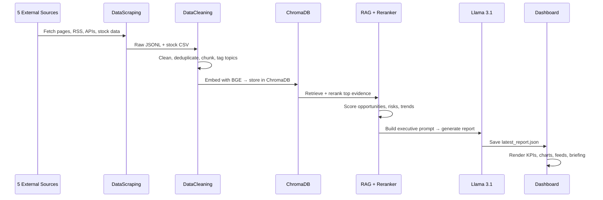
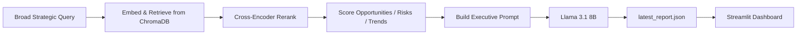

# ✈️ Airbus Strategic Intelligence Engine

An AI-powered Strategic Intelligence Agent that collects live data about Airbus, analyzes it for opportunities, risks and trends, and generates executive-level CEO briefings via a Streamlit dashboard.

> *"If you were the CEO today, what would you do next and why?"*

---

## System Architecture



---

## Data Flow



---

## Technology Stack

| Layer | Technology | Purpose |
|---|---|---|
| Data Collection | requests, BeautifulSoup, feedparser, yfinance | Scrape 5 live sources |
| Storage | JSONL, CSV, ChromaDB | Raw data, cleaned chunks, vector index |
| Embeddings | `BAAI/bge-small-en-v1.5` | Dense vector representation of chunks |
| Reranking | `cross-encoder/ms-marco-MiniLM-L-6-v2` | Improve evidence quality before prompting |
| Strategic Analysis | Keyword-weight scoring | Classify evidence into opportunities, risks, trends |
| LLM | Ollama · `llama3.1:8b` | Local CEO report generation |
| Sentiment | TextBlob | Polarity scoring across corpus |
| Dashboard | Streamlit, Plotly, pandas | Executive UI with charts and downloadable reports |

---

## AI Pipeline



The agent uses a fixed broad query covering all strategic dimensions — opportunities, risks, trends, competitors, hydrogen, AI, supply chain. It retrieves the top 15 chunks, reranks to the best 5, classifies them into intelligence signals, then instructs Llama to produce a structured 7-section CEO report autonomously.

---

## Key Design Decisions

**1. Pre-generate, then display** — The heavy pipeline (RAG + Ollama) runs offline via `generate_report.py`. The dashboard reads the saved JSON instantly, keeping the UI responsive.

**2. Retrieve then rerank** — Vector search retrieves a wide candidate set fast; the cross-encoder reranker then improves precision before the LLM sees the evidence.

**3. Evidence-constrained prompting** — The prompt explicitly instructs Llama to use only retrieved evidence and cite source titles, reducing hallucination and making recommendations traceable.

**4. Autonomous agent design** — No user query is needed. The agent reasons freely over all retrieved evidence and decides what to report — behaving like an always-on intelligence advisor.

**5. Local LLM** — `llama3.1:8b` runs locally through Ollama, keeping the corpus private with no dependency on commercial APIs.

---

## Dashboard Sections

| Tab | What it shows |
|---|---|
| 📌 Company Overview | KPIs, stock price, source breakdown |
| 📊 Market Intelligence | Charts, 90-day stock, live news/competitor/tech feeds |
| 😊 Sentiment Analysis | Polarity by source/topic, stock + sentiment overlay |
| 🚀 Opportunities | Evidence-backed cards with impact level and confidence |
| ⚠️ Risks & Trends | Risk and trend cards with severity |
| 🎯 Recommendations | LLM strategic recommendations |
| 🧠 CEO Briefing | What happened · Why it matters · What to do next |

---

## Setup & Run

```bash
pip install -r requirements.txt
# add GUARDIAN_API_KEY to .env (free key at open-platform.theguardian.com)

python DataScraping/run_collection.py   # collect data
python DataCleaning/data_clean.py       # clean & chunk
python VectorDB/store_to_chroma.py      # embed & index
python generate_report.py              # run CEO agent (needs Ollama running)
streamlit run Dashboard/app.py         # launch dashboard
```
