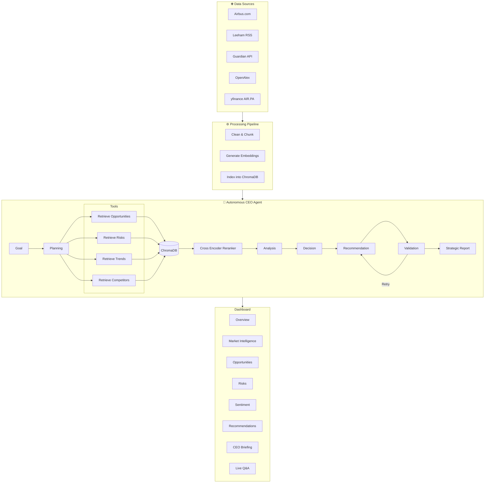

# ✈️ Airbus Autonomous Strategic Intelligence CEO Agent

An autonomous AI agent that continuously analyzes Airbus using Retrieval-Augmented Generation (RAG), strategic reasoning, and LLM-powered decision making.

Instead of acting as a simple chatbot, the system follows an agentic workflow that plans, retrieves evidence, analyzes market intelligence, validates its reasoning, and produces executive-level strategic recommendations.

---

# Overview

This project was developed as an autonomous AI agent for strategic business intelligence.

The system collects information from multiple trusted sources including Airbus, aviation news, academic publications, and financial markets. After preprocessing and indexing the knowledge base, the CEO Agent autonomously reasons over the available evidence to identify:

- Strategic opportunities
- Business risks
- Technology trends
- Competitive intelligence
- Executive recommendations

A Streamlit dashboard provides interactive visualizations together with a live Q&A interface.

---

# Features

- Autonomous multi-step CEO Agent
- Retrieval-Augmented Generation (RAG)
- Semantic search using ChromaDB
- Cross-Encoder reranking
- Llama 3.1 powered reasoning
- Executive recommendation generation
- Market intelligence dashboard
- Interactive strategic Q&A
- Company sentiment analysis
- Competitor monitoring
- Financial overview
- Modular architecture

---

# System Architecture



---

# Data Sources

The knowledge base is automatically built using multiple trusted sources.

| Source | Purpose |
|---------|----------|
| Airbus Official Website | Company announcements |
| Leeham News | Aviation industry news |
| Guardian API | Global news |
| OpenAlex | Research publications |
| Yahoo Finance | Airbus stock data |

---

# Processing Pipeline

The processing stage prepares raw information for semantic retrieval.

```
Raw Documents
      │
      ▼
Cleaning
      │
      ▼
Chunking
      │
      ▼
Embedding Generation
(BAAI/bge-small-en-v1.5)
      │
      ▼
ChromaDB Vector Store
```

Current knowledge base:

- **725 documents**
- **583 indexed chunks**

---

# Autonomous CEO Agent Workflow

Unlike traditional RAG systems, this project follows an autonomous reasoning loop.

## 1. Goal

Receive a strategic objective.

Example:

> Analyze Airbus' strategic position.

---

## 2. Planning

Break the objective into multiple retrieval tasks.

- Opportunities
- Risks
- Competitors
- Technology
- Sustainability

---

## 3. Evidence Retrieval

Each tool independently queries the vector database.

```
Opportunity Retriever

Risk Retriever

Competitor Retriever

Trend Retriever
```

---

## 4. Reranking

Retrieved chunks are reranked using a Cross Encoder.

This improves retrieval quality before reasoning.

---

## 5. Strategic Analysis

Llama 3.1 analyzes evidence to identify

- emerging risks
- market opportunities
- technology trends
- competitive insights

---

## 6. Decision

The agent evaluates whether enough evidence has been collected.

If not:

- retrieve again
- refine reasoning

---

## 7. Recommendation

Generate executive-level recommendations.

Examples:

- Invest
- Monitor
- Partner
- Mitigate risk
- Expand research

---

## 8. Validation

The generated report is evaluated.

If quality is insufficient:

- regenerate
- retry (maximum 3 iterations)

Otherwise the report is exported.

---

# Dashboard

The Streamlit dashboard contains:

- Company Overview
- Market Intelligence
- Opportunities
- Risks
- Industry Trends
- Sentiment Analysis
- CEO Recommendations
- Executive Briefing
- Live Strategic Q&A

---

# Live Q&A

The dashboard also includes an interactive RAG-powered assistant.

Pipeline:

```
User Question

↓

Retriever

↓

Cross Encoder Reranker

↓

Context Construction

↓

Llama 3.1

↓

Answer with Sources
```

Example questions:

- What is Airbus doing with hydrogen aircraft?
- What are Airbus' biggest supply chain risks?
- What AI initiatives is Airbus pursuing?
- How is Airbus competing with Boeing?
- What sustainability trends should Airbus monitor?

---

# Project Structure

```
.
├── CEOAgent/
│   ├── ceo_agent.py
│   └── llm_agent.py
│
├── RAG/
│   ├── retriever.py
│   ├── reranker.py
│   ├── prompt_builder.py
│   └── query_engine.py
│
├── Dashboard/
│   ├── app.py
│   └── qa_page.py
│
├── DataScraping/
│
├── data/
│
├── reports/
│
└── README.md
```

---

# Technology Stack

| Category | Technology |
|-----------|------------|
| Language | Python |
| Dashboard | Streamlit |
| LLM | Llama 3.1 8B (Ollama) |
| Embeddings | BAAI/bge-small-en-v1.5 |
| Vector Database | ChromaDB |
| Reranker | Cross Encoder |
| Data Collection | BeautifulSoup, RSS, APIs |
| Financial Data | yfinance |

---

# Installation

Clone the repository

```bash
git clone <repository_url>
```

Install dependencies

```bash
pip install -r requirements.txt
```

Start Ollama

```bash
ollama run llama3.1:8b
```

Launch the dashboard

```bash
streamlit run Dashboard/app.py
```

---

# Author

**Sharvari Shewdikar**

M.Sc. Applied Data Science & Artificial Intelligence

SRH University Heidelberg

---
