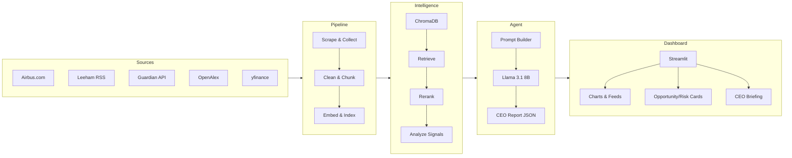
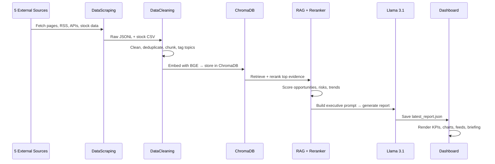
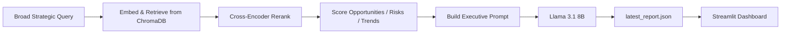

# ✈️ Airbus Strategic Intelligence Engine

An AI-powered Strategic Intelligence Agent that collects live data about Airbus, analyzes it for opportunities, risks and trends, and generates executive-level CEO briefings via a Streamlit dashboard.

> *"If you were the CEO today, what would you do next and why?"*

---

## System Architecture

---

## Data Flow

---

## Technology Stack

| Layer | Technology | Purpose |
|---|---|---|
| Data Collection | requests, BeautifulSoup, feedparser, yfinance | Scrape 5 live sources |
| Storage | JSONL, CSV, ChromaDB | Raw data, cleaned chunks, vector index |
| Embeddings | `BAAI/bge-small-en-v1.5` | Dense vector representation of chunks |
| Reranking | `cross-encoder/ms-marco-MiniLM-L-6-v2` | Improve evidence quality before prompting |
| Strategic Analysis | Keyword-weight scoring | Classify evidence into opportunities, risks, trends |
| LLM | Ollama · `llama3.1:8b` | Local CEO report generation |
| Sentiment | TextBlob | Polarity scoring across corpus |
| Dashboard | Streamlit, Plotly, pandas | Executive UI with charts and downloadable reports |

---

## AI Pipeline

1. `DataScraping/run_collection.py` collects Airbus-related data and writes source-specific JSONL files plus `all_documents.jsonl`.
2. `DataCleaning/data_clean.py` removes boilerplate, drops low-quality or irrelevant documents, deduplicates titles, assigns strategic topics, and creates retrieval-ready chunks.
3. `VectorDB/store_to_chroma.py` embeds each cleaned chunk with `BAAI/bge-small-en-v1.5` and stores the chunk text, metadata, and vector in ChromaDB.

#### Runtime RAG and Agent Pipeline

```mermaid
flowchart LR
    Q["Strategic query"] --> R["Embed query"]
    R --> S["Retrieve top candidates from ChromaDB"]
    S --> T["Deduplicate by title"]
    T --> U["Cross-encoder rerank"]
    U --> V["Opportunity/risk/trend scoring"]
    V --> W["Build executive prompt"]
    W --> X["Generate report with llama3.1:8b"]
    X --> Y["Save reports/latest_report.json"]
    Y --> Z["Display in Streamlit dashboard"]
```

- `RAG/retriever.py` embeds the query and retrieves matching chunks from ChromaDB.
- `RAG/reranker.py` reranks candidate chunks using `cross-encoder/ms-marco-MiniLM-L-6-v2`.
- `StrategicIntelligenceEngine/strategic_analyzer.py` scores chunks for opportunities, risks, and trends using weighted strategic keywords.
- `RAG/prompt_builder.py` builds a structured CEO-report prompt with evidence snippets and detected intelligence signals.
- `CEOAgent/ceo_agent.py` runs the autonomous strategic query and calls the local LLM through `CEOAgent/llm_agent.py`.
- `generate_report.py` saves the generated report and supporting evidence to `reports/latest_report.json`.
- `Dashboard/app.py` displays the report, opportunities, risks, trends, recommendations, sentiment analysis, stock chart, source mix, and recent intelligence feeds.

---
